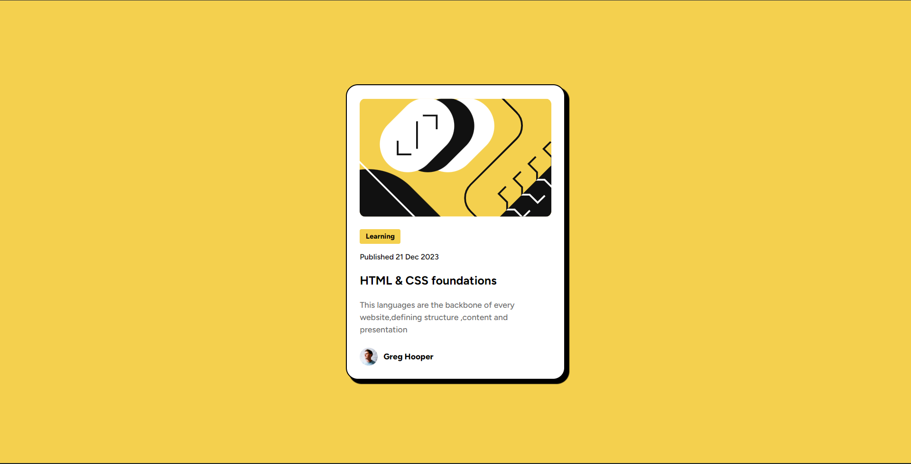
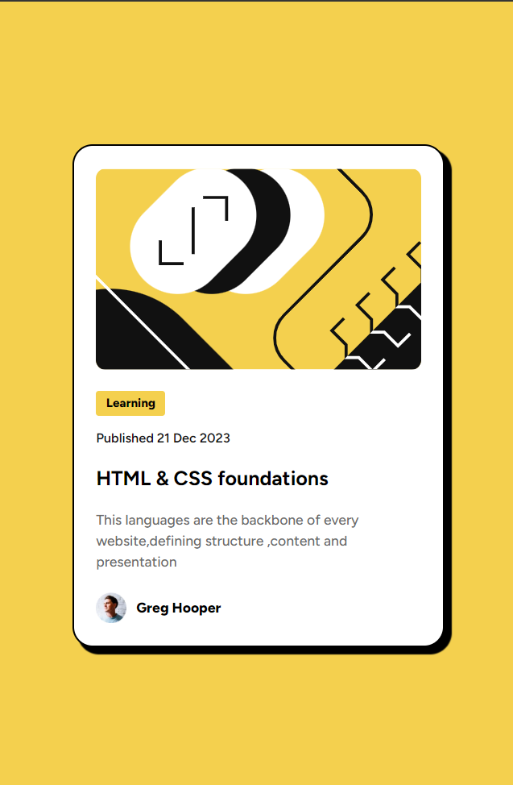

# Blog Preview Card 

# Frontend Mentor - Blog Preview Card Solution

This is my solution to the [Blog preview card challenge on Frontend Mentor](https://www.frontendmentor.io/solutions/responsive-blog-preview-card-AVeMaTYtXv).

## 📋 Overview

### The Challenge
This challenge focused on handling typography, spacing (padding/margin), and interactive hover states for a blog-style card.

### Screenshot
| Desktop | Mobile |
| :---: | :---: |
|  |  |

### Links
- **Live Site URL:** [View Project](https://codamee.github.io/frontend-mentor-projects/02-blog-preview-card/)

---

## 🏗️ My Process

### Built With
- **HTML5**
- **CSS Custom Properties**
- **CSS Flexbox**
- **Box Shadows** (Custom offset and blur)
- **Google Fonts** (Outfit)

### What I Learned
I practiced creating a specific "hard shadow" effect to match the neo-brutalist design of the challenge. I also focused on making sure the card scales nicely for mobile users.
